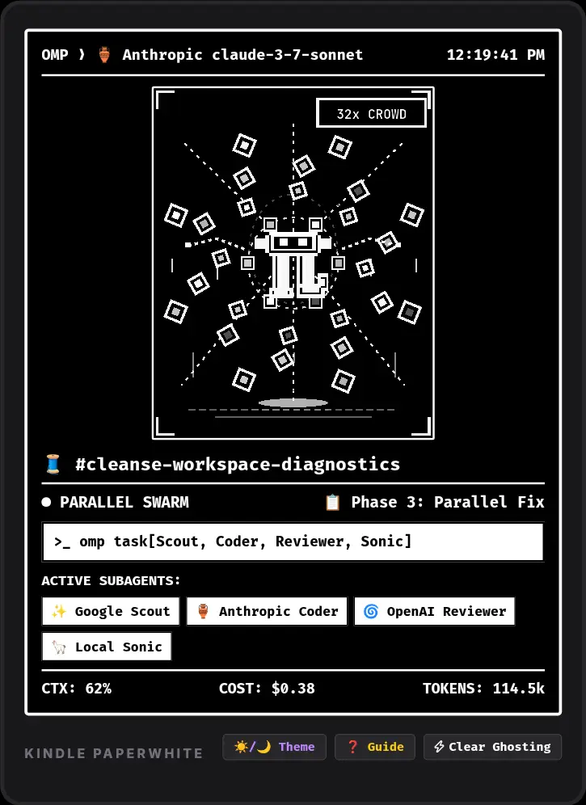
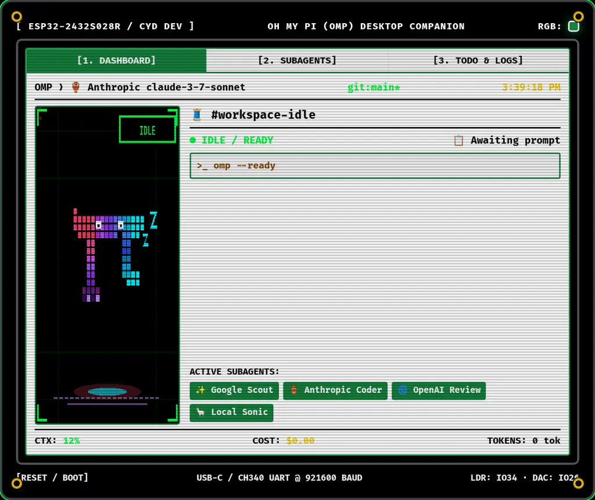
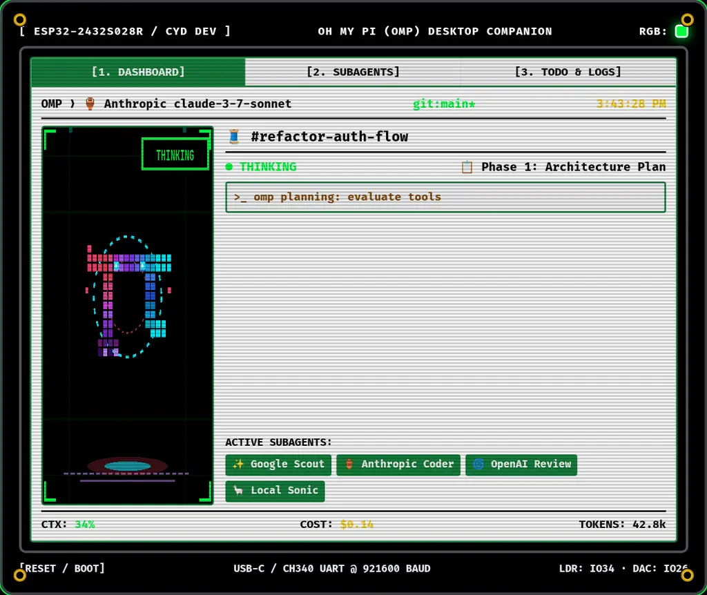
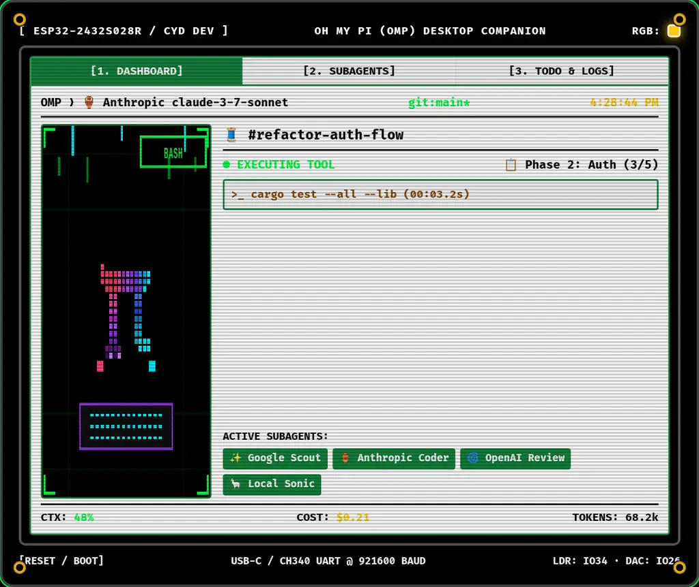
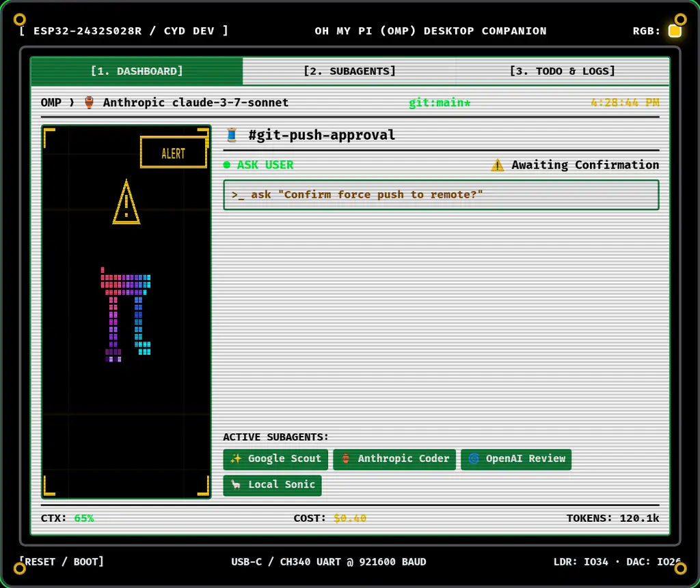
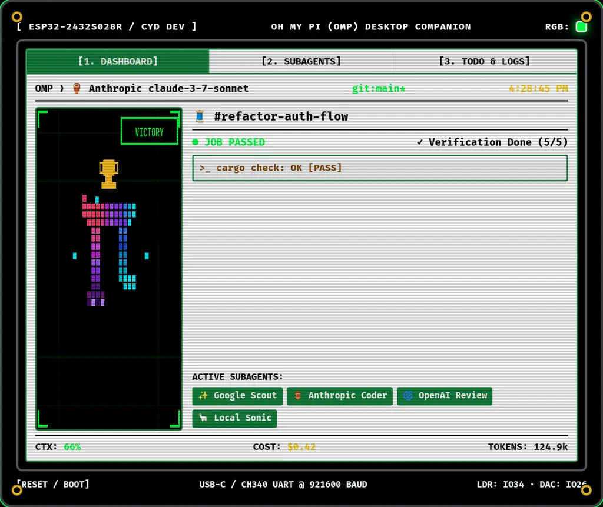
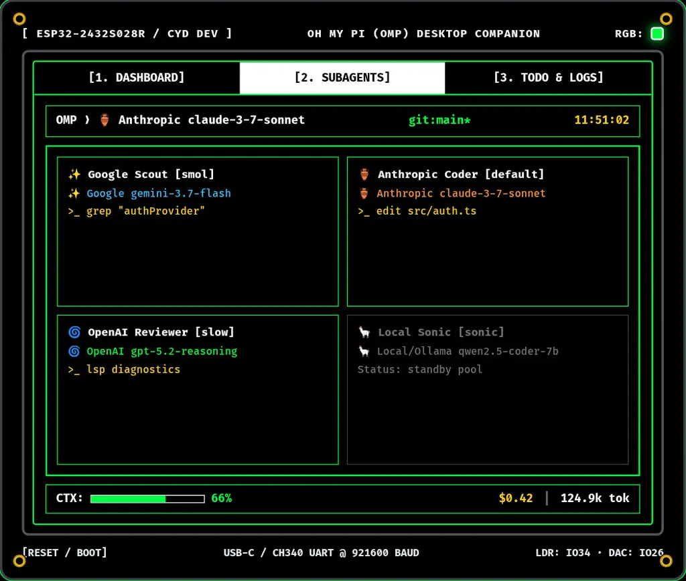
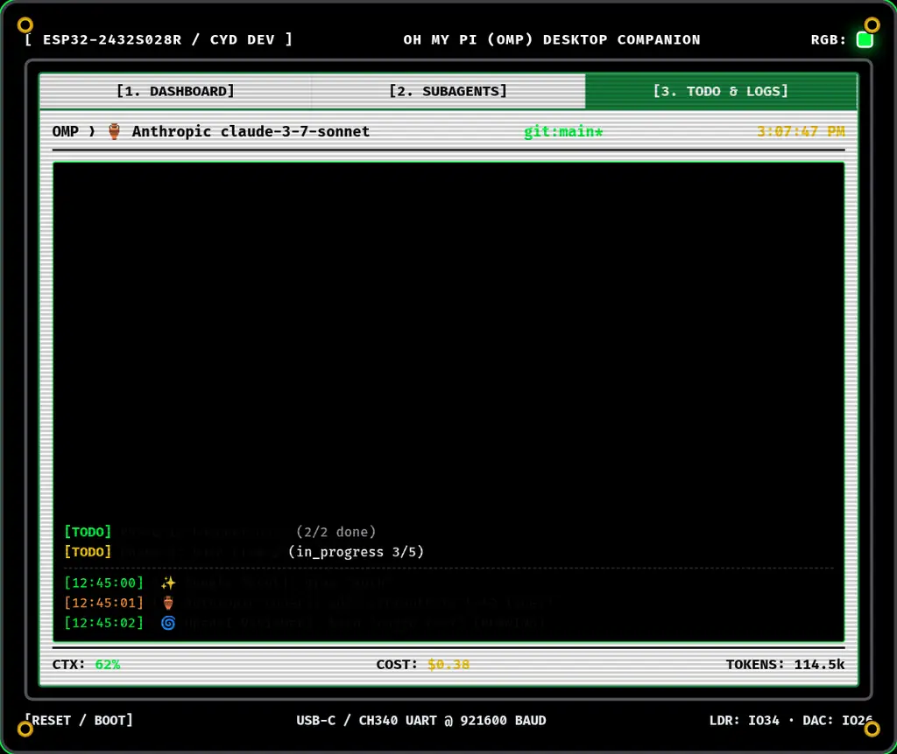
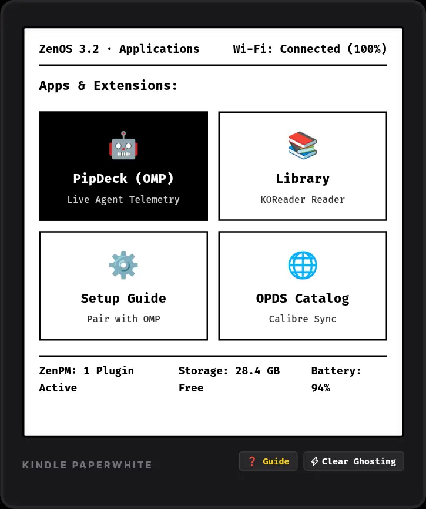

# PipDeck 📖⚡ — Kindle KOReader, ZenOS & Hardware Companion for Oh My Pi (OMP)

[](https://github.com/officebeats/pipdeck/releases)
[](https://officebeats.github.io/pipdeck/gallery.html)
[](https://github.com/koreader/koreader)
[](https://officebeats.github.io/pipdeck)
[](https://officebeats.github.io/pipdeck)
[](https://opensource.org/licenses/MIT)

> **PipDeck v0.1.0-alpha** is an open-source hardware companion display engineered primarily for **jailbroken Amazon Kindle e-ink devices running KOReader and ZenOS (Tier 1)** with dedicated optimization for **older Kindle Paperwhite devices (PW1, PW2, PW3, PW4, PW5, Basic, Touch)**, plus secondary support for **ESP32 micro-displays (Tier 2)**. It connects wirelessly over local Wi-Fi with mDNS auto-discovery, delivering real-time agent telemetry, chat thread tracking, subagent swarm matrix status, and 1-bit retro LCD/e-ink mascot animations with a full-bleed canvas, default 12-hour clock, and instant **Light Mode (Paper Day)** & **Dark Mode (OLED Night)** theme switching.
>
> 🖼️ **Visual Screenshot Gallery**: [https://officebeats.github.io/pipdeck/gallery.html](https://officebeats.github.io/pipdeck/gallery.html)
>
> 🌐 **Live Web Simulator & 1-Click Installer**: [https://officebeats.github.io/pipdeck](https://officebeats.github.io/pipdeck) *(Type: `officebeats.github.io/pipdeck`)*
>
> 📦 **Alpha Release ZIP**: [pipdeck-koreader-paperwhite-v0.1.0-alpha.zip](https://officebeats.github.io/pipdeck/dist/pipdeck-koreader-paperwhite-v0.1.0-alpha.zip)

---

## 📸 Primary Platform Showcase: Kindle E-Ink (KOReader & ZenOS)

Pure 1-bit high-contrast monochrome rendering with responsive **Portrait**, **Landscape**, **ZenOS App Launcher**, and **Light & Dark Theme** modes:

| 📖 Kindle Portrait (Light Mode) | 🌙 Kindle Portrait (Dark Mode) | 📖 Kindle Landscape Mode |
| :---: | :---: | :---: |
| [](https://officebeats.github.io/pipdeck/assets/screenshots/kindle-portrait.webp) | [](https://officebeats.github.io/pipdeck/assets/screenshots/kindle-dark-mode.webp) | [](https://officebeats.github.io/pipdeck/assets/screenshots/kindle-landscape.webp) |
| [Open Full Resolution](https://officebeats.github.io/pipdeck/assets/screenshots/kindle-portrait.webp) | [Open Full Resolution](https://officebeats.github.io/pipdeck/assets/screenshots/kindle-dark-mode.webp) | [Open Full Resolution](https://officebeats.github.io/pipdeck/assets/screenshots/kindle-landscape.webp) |

---

## 📸 Secondary Platform Showcase: ESP32 2.8" SPI Color LCD (CYD)

Unified high-contrast design featuring the exact **Oh My Pi (OMP) terminal logo sunset-cyberpunk palette** (`#ff4071` Hot Pink $\to$ `#9333ea` Purple $\to$ `#00f0ff` Cyan):

| 📟 ESP32 32-Node Swarm (`32x CROWD`) | 💤 ESP32 Idle State (`IDLE`) | 🧠 ESP32 Thinking State (`THINKING`) |
| :---: | :---: | :---: |
| [](https://officebeats.github.io/pipdeck/assets/screenshots/dashboard-swarm-32.webp) | [](https://officebeats.github.io/pipdeck/assets/screenshots/dashboard-idle.webp) | [](https://officebeats.github.io/pipdeck/assets/screenshots/dashboard-thinking.webp) |
| [Open Full Resolution](https://officebeats.github.io/pipdeck/assets/screenshots/dashboard-swarm-32.webp) | [Open Full Resolution](https://officebeats.github.io/pipdeck/assets/screenshots/dashboard-idle.webp) | [Open Full Resolution](https://officebeats.github.io/pipdeck/assets/screenshots/dashboard-thinking.webp) |

| ⌨️ ESP32 Tool / Bash (`BASH`) | ⚠️ ESP32 Ask / Alert (`ALERT`) | 🏆 ESP32 Job Passed (`VICTORY`) |
| :---: | :---: | :---: |
| [](https://officebeats.github.io/pipdeck/assets/screenshots/dashboard-bash.webp) | [](https://officebeats.github.io/pipdeck/assets/screenshots/dashboard-alert.webp) | [](https://officebeats.github.io/pipdeck/assets/screenshots/dashboard-victory.webp) |
| [Open Full Resolution](https://officebeats.github.io/pipdeck/assets/screenshots/dashboard-bash.webp) | [Open Full Resolution](https://officebeats.github.io/pipdeck/assets/screenshots/dashboard-alert.webp) | [Open Full Resolution](https://officebeats.github.io/pipdeck/assets/screenshots/dashboard-victory.webp) |

| 👥 ESP32 Subagents Tab View | 📋 ESP32 TODO & Logs Tab View | 🌌 ZenOS 3.2 App Launcher Mode |
| :---: | :---: | :---: |
| [](https://officebeats.github.io/pipdeck/assets/screenshots/dashboard-subagents.webp) | [](https://officebeats.github.io/pipdeck/assets/screenshots/dashboard-todo-logs.webp) | [](https://officebeats.github.io/pipdeck/assets/screenshots/zenos-launcher.webp) |
| [Open Full Resolution](https://officebeats.github.io/pipdeck/assets/screenshots/dashboard-subagents.webp) | [Open Full Resolution](https://officebeats.github.io/pipdeck/assets/screenshots/dashboard-todo-logs.webp) | [Open Full Resolution](https://officebeats.github.io/pipdeck/assets/screenshots/zenos-launcher.webp) |

👉 **[Open Interactive Full-Screen Visual Gallery](https://officebeats.github.io/pipdeck/gallery.html)**

---

## ⚠️ Prerequisite for Kindle Users

PipDeck runs as a KOReader plugin / KUAL extension on Amazon Kindle e-ink hardware.
- **Requirement**: You must have a **jailbroken Kindle with KOReader installed**.
- **Don't know what that is?** 👉 **[Let Me Google That For You 🖱️](https://letmegooglethat.com/?q=how+to+jailbreak+kindle+and+install+koreader)**

---

## 🔌 Zero-Hassle Installation for Paperwhite & Kindle Users

PipDeck provides triple-store integration across KOReader, ZenOS, and KUAL:

### Method 1: 1-Click Web Drive Installer *(Recommended — Zero File Hunting)*
1. Plug your Kindle Paperwhite into your computer via USB.
2. Open **[officebeats.github.io/pipdeck](https://officebeats.github.io/pipdeck)** in Chrome, Edge, or Brave.
3. Click **`[ ⚡ Install to Kindle Drive ]`** and select your Kindle drive (e.g. `E:\` or `/Volumes/Kindle`).
4. The browser automatically writes `pipdeck.koplugin` to `koreader/plugins/` and the KUAL extension to `extensions/pipdeck/`. Safely eject and launch!

### Method 2: In-Kindle ZenPM Store *(Zero Cables / Direct Wi-Fi)*
1. On your Kindle running **ZenOS / ZenUI**, open **ZenPM** (Package Manager).
2. Search for **"PipDeck"** and tap **`[ Install ]`**.

### Method 3: 1-Step Drag & Drop Alpha ZIP
1. Download **[pipdeck-koreader-paperwhite-v0.1.0-alpha.zip](https://officebeats.github.io/pipdeck/dist/pipdeck-koreader-paperwhite-v0.1.0-alpha.zip)**.
2. Drag the unzipped `koreader` and `extensions` folders straight onto your Kindle drive root.

---

## ☀️ Light Mode & 🌙 Dark Mode Architecture

PipDeck supports seamless day/night theme switching on both E-Ink and color LCD hardware:
- **Kindle E-Ink (KOReader / ZenOS / KUAL)**:
  - **☀️ Light Mode (Day)**: Pure Paper White (`#ffffff`) background with stark black borders and typography.
  - **🌙 Dark Mode (Night)**: Pure Black (`#000000`) background with high-contrast white typography and inverted badges.
- **ESP32 Color Display**:
  - **🌙 Dark Matrix Mode**: Pitch black (`#000000`) OLED background with neon matrix green (`#00ff41`) and cyber-yellow accents.
  - **☀️ Light Terminal Mode**: Pure white (`#ffffff`) background with emerald green (`#15803d`) borders and dark typography.

---

## ⚡ Universal Low-Framerate Stepped Animation Invariant (LED/LCD Pace)

Every animation across all SVGs, UI widgets, and graphic assets in PipDeck **strictly uses discrete stepped keyframes (`steps(N)`)**:
- **Smooth `linear` and `ease-in-out` transitions are strictly prohibited.**
- **Mascot levitation & breathing**: `steps(2)` to `steps(4)`.
- **Orbital rotations (1 to 32 nodes)**: `steps(8)` to `steps(16)`.
- **Matrix code rain & confetti**: `steps(6)` to `steps(8)`.
- **Lightning strobe & eye blinks**: `steps(2)`.
- **Display Pacing Rationale**:
  - **Kindle E-Ink (KOReader & ZenOS Primary)**: 1–2 FPS event-stepped low-pace refresh prevents electrophoretic particle fatigue and preserves weeks of battery life.
  - **ESP32 Micro-Displays (Secondary)**: 4–8 FPS retro LCD stepped motion delivers authentic vintage hardware matrix stutter.

---

## 🤖 Pure Floating Mascot & Reactive Orca Pet Bundle Architecture

PipDeck enforces a **pure floating, shadowless 25% scaled $\pi$ mascot** ($43 \times 50\text{px}$ bounding box centered at $(80, 100)$) across all swarm counts (1 to 32 nodes) and all lifecycle states (`IDLE`, `THINKING`, `BASH`, `SWARM`, `ALERT`, `VICTORY`).

- **Zero Drop Shadows**: All overlapping ground shadow disks and floor meshes have been eliminated for a weightless floating aesthetic.
- **Interactive Orca Pet Bundle**: Includes a full 9-row $\times$ 8-column spritesheet bundle (`assets/orca-pet-bundle/`) that dynamically reflects live OMP agent turns and Orca chat activity:
  - **Row 0 (`idle`)**: Ambient floating levitation when agent is standby / idle.
  - **Row 1 & 2 (`running-right` / `running-left`)**: Directional tilt and dash when dragged.
  - **Row 3 (`waving`)**: Crossbar waving greeting.
  - **Row 4 (`jumping`)**: Golden sparkle victory leap on mouse hover or task completion.
  - **Row 5 (`failed`)**: Strobe alert and warning triangle on errors / blocked prompt.
  - **Row 6 (`waiting`)**: Luminous thought ring orbital when agent is thinking or awaiting input.
  - **Row 7 (`running`)**: Cybernetic typing hands and matrix stream on active tool execution (`bash`, `read`, `edit`, `write`).
  - **Row 8 (`review`)**: Floating trophy and celebration confetti on `agent_settled` (job passed).

### 5-Agent Incremental Swarm Hierarchy (Full-Bleed Canvas & Top-Right HUD)

| Swarm Level | Combo HUD Tag | Mascot Size Invariant | Stepped Animation Timing | Visual Density Feeling |
| :--- | :--- | :--- | :--- | :--- |
| **1 Node** | `[ 1x SOLO ]` | Persistently Centered ($43 \times 50\text{px}$) | `8s steps(8)` solo orbit | Minimalist, single-turn focus. |
| **5 Nodes** | `[ 5x SWARM ]` | Persistently Centered ($43 \times 50\text{px}$) | `10s steps(10)` pentagon web | Clean geometric wave. |
| **10 Nodes** | `[ 10x DUAL ]` | Persistently Centered ($43 \times 50\text{px}$) | Dual rings: `8s steps(8)` / `14s steps(12)` | Balanced dual-orbital flow. |
| **15 Nodes** | `[ 15x TRIPLE ]` | Persistently Centered ($43 \times 50\text{px}$) | 3 rings: `8s steps(8)` / `12s steps(10)` / `18s steps(12)` | Active multi-agent web. |
| **20 Nodes** | `[ 20x HIVE ]` | Persistently Centered ($43 \times 50\text{px}$) | 3 rings: `8s steps(8)` / `12s steps(10)` / `18s steps(14)` | Dense, humming swarm hive. |
| **25 Nodes** | `[ 25x MATRIX ]` | Persistently Centered ($43 \times 50\text{px}$) | 4 rings: `8s steps(8)` to `22s steps(14)` | Heavily crowded particle matrix. |
| **32 Nodes (MAX)**| `[ 32x CROWD ]` | Persistently Centered ($43 \times 50\text{px}$) | 4 bounded rings: `6s steps(8)` to `18s steps(16)` + matrix rain | **Maximum Swarm Crowding** (controlled chaos). |
---

## 🛒 Target Hardware & Devices

### 1. Primary Platform: Upcycled E-Ink Reader (Kindle + KOReader / ZenOS / KUAL)
- **Flagship Target**: **Amazon Kindle Paperwhite (PW1, PW2, PW3, PW4, PW5)**, plus Kindle Keyboard K3, Touch, Basic, Oasis, and Scribe running [KOReader](https://github.com/koreader/koreader), [ZenOS / ZenUI](https://github.com/AnthonyGress/zen_ui.koplugin), or KUAL. Connects wirelessly over local Wi-Fi with weeks of battery life and default 12-hour clock.

### 2. Secondary Platform: Dedicated Color Hardware Display (ESP32)
- **Target Board**: **[AOICRIE ESP32-2432S028R 2.8" SPI TFT LCD (Amazon)](https://www.amazon.com/AOICRIE-Development-ESP32-2432S028R-Bluetooth-Resistive/dp/B0FFGZTGYN)**  
  *(ESP32-WROOM-32, 2.8" $320 \times 240$ SPI TFT with ILI9341 driver, XPT2046 resistive touch, onboard RGB LED, light sensor LDR, mono audio DAC speaker header, and USB-C).*

---

## 🛠️ Quick Start & Installation

### 1. OMP Host Daemon Setup
Drop the companion server into your local Oh My Pi directory:
```bash
mkdir -p ~/.omp/agent/extensions
cp firmware/host/pipdeck-server.ts ~/.omp/agent/extensions/
```

### 2. Live Web Simulator
Visit [https://officebeats.github.io/pipdeck](https://officebeats.github.io/pipdeck) in any browser to test all platforms with real-time controls, Light/Dark themes, and 1-click Kindle installer.

---

## 📜 Invariants & Rules (In Perpetuity)
- `PRD.md` and `README.md` are kept strictly synchronized in lockstep across all feature definitions and code changes. See [RULES.md](RULES.md).
- Released under the [MIT License](LICENSE). Built with 💚 for the **Oh My Pi (OMP)**, **KOReader**, and **ZenOS** communities.
