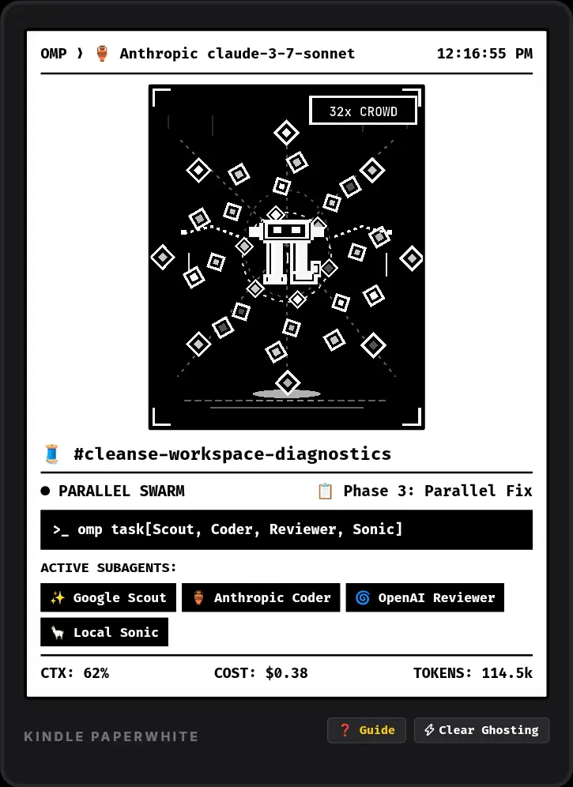
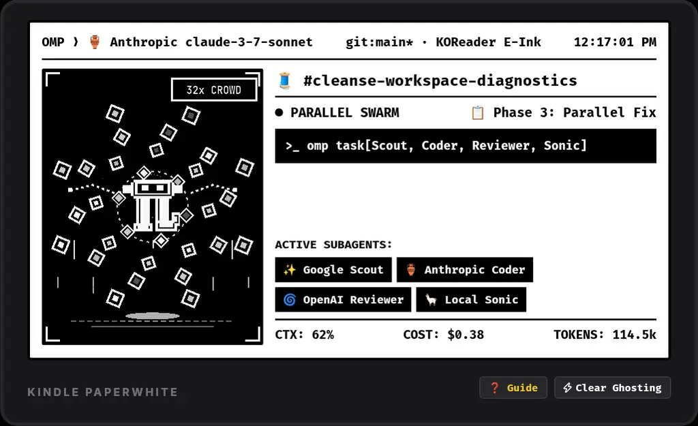
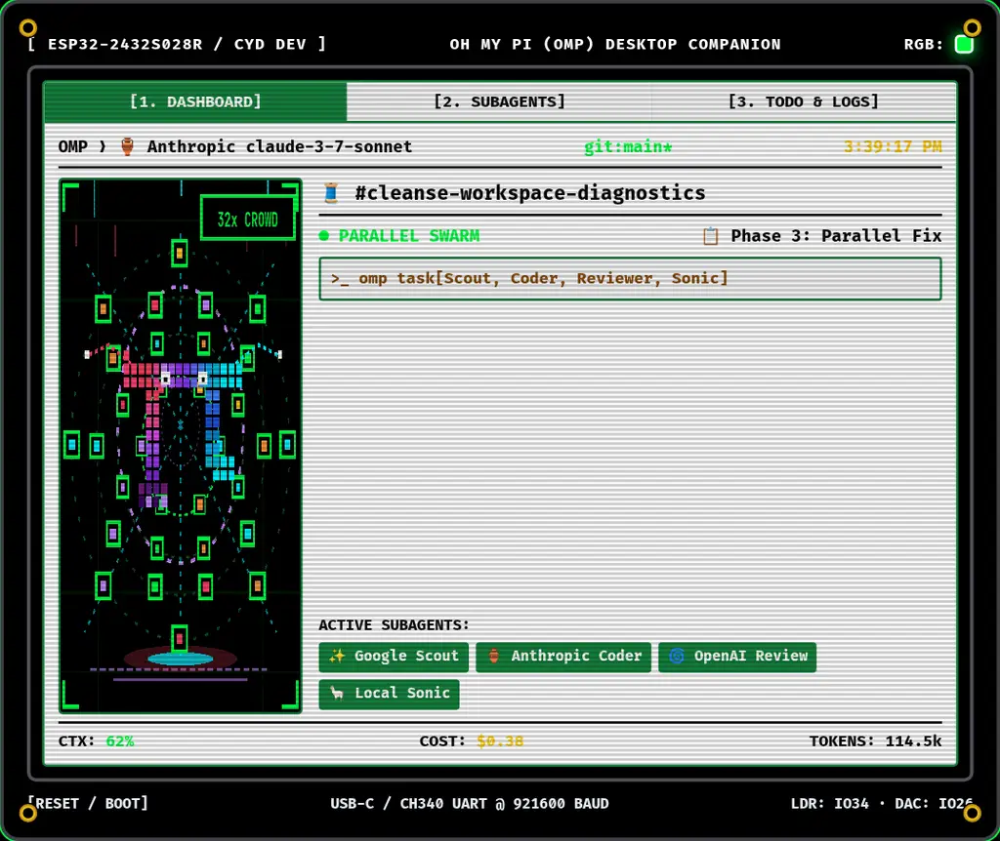

# PipDeck 📖⚡ — Kindle KOReader & Hardware Companion for Oh My Pi (OMP)

[](https://github.com/koreader/koreader)
[](https://www.amazon.com/AOICRIE-Development-ESP32-2432S028R-Bluetooth-Resistive/dp/B0FFGZTGYN)
[](https://opensource.org/licenses/MIT)
[](https://github.com/officebeats/pipdeck)

> **PipDeck** is an open-source hardware companion display engineered primarily for **jailbroken Amazon Kindle e-ink devices running KOReader (Tier 1)**, with secondary support for **ESP32 micro-displays (Tier 2)**. It connects wirelessly over local Wi-Fi with mDNS auto-discovery, delivering real-time agent telemetry, chat thread tracking, subagent swarm matrix status, and 1-bit retro LCD/e-ink mascot animations with zero configuration.

---

## 📸 Primary Platform Showcase: Kindle E-Ink (KOReader)

Pure 1-bit high-contrast monochrome rendering with responsive **Portrait** and **Landscape** auto-orientation and e-ink ghosting mitigation:

| Kindle Portrait Mode (600×800 / 1072×1448) | Kindle Landscape Mode (800×600 / 1448×1072) |
| :---: | :---: |
| [](assets/screenshots/kindle-portrait.webp) | [](assets/screenshots/kindle-landscape.webp) |

---

## 📸 Secondary Platform Showcase: ESP32 2.8" SPI Color LCD (CYD)

High-contrast Matrix phosphor green theme on pure `#000000` OLED black with active RGB underglow:
[](assets/screenshots/dashboard-swarm-32.webp)

---

## ⚡ Universal Low-Framerate Stepped Animation Invariant (LED/LCD Pace)

Every animation across all SVGs, UI widgets, and graphic assets in PipDeck **strictly uses discrete stepped keyframes (`steps(N)`)**:
- **Smooth `linear` and `ease-in-out` transitions are strictly prohibited.**
- **Mascot levitation & breathing**: `steps(2)` to `steps(4)`.
- **Orbital rotations (1 to 32 nodes)**: `steps(8)` to `steps(16)`.
- **Matrix code rain & confetti**: `steps(6)` to `steps(8)`.
- **Lightning strobe & eye blinks**: `steps(2)`.
- **Display Pacing Rationale**:
  - **Kindle E-Ink (KOReader Primary)**: 1–2 FPS event-stepped low-pace refresh prevents electrophoretic particle fatigue and preserves weeks of battery life.
  - **ESP32 Micro-Displays (Secondary)**: 4–8 FPS retro LCD stepped motion delivers authentic vintage hardware matrix stutter.

---

## 5-Agent Incremental Swarm Hierarchy

Pip maintains a **strictly constant large bounding box ($48 \times 48\text{px}$)** centered at $(80, 100)$ across all swarm increments ($1 \to 32$ nodes) and lifecycle states (`IDLE`, `THINKING`, `BASH`, `SWARM`, `ALERT`, `VICTORY`):

| Swarm Level | Mascot Size Invariant | Stepped Animation Timing | Visual Density Feeling |
| :--- | :--- | :--- | :--- |
| **1 Node** | Persistently Large ($48 \times 48\text{px}$) | `8s steps(8)` solo orbit | Minimalist, single-turn focus. |
| **5 Nodes** | Persistently Large ($48 \times 48\text{px}$) | `10s steps(10)` pentagon web | Clean geometric wave. |
| **10 Nodes** | Persistently Large ($48 \times 48\text{px}$) | Dual rings: `8s steps(8)` / `14s steps(12)` | Balanced dual-orbital flow. |
| **15 Nodes** | Persistently Large ($48 \times 48\text{px}$) | 3 rings: `8s steps(8)` / `12s steps(10)` / `18s steps(12)` | Active multi-agent web. |
| **20 Nodes** | Persistently Large ($48 \times 48\text{px}$) | 3 rings: `8s steps(8)` / `12s steps(10)` / `18s steps(14)` | Dense, humming swarm hive. |
| **25 Nodes** | Persistently Large ($48 \times 48\text{px}$) | 4 rings: `8s steps(8)` / `12s steps(10)` / `16s steps(12)` / `22s steps(14)` | Heavily crowded particle matrix. |
| **32 Nodes (MAX)**| Persistently Large ($48 \times 48\text{px}$) | 4 bounded rings: `8s steps(8)` to `28s steps(16)` + matrix rain | **Maximum Swarm Crowding** (controlled chaos). |

---

## 🛒 Target Hardware & Devices

### 1. Primary Platform: Upcycled E-Ink Reader (Kindle + KOReader)
- Any jailbroken **Amazon Kindle** (Paperwhite 2/3/4/5, Oasis, Basic, Scribe) running [KOReader](https://github.com/koreader/koreader). Connects wirelessly over local Wi-Fi with weeks of battery life.

### 2. Secondary Platform: Dedicated Color Hardware Display (ESP32)
- **Target Board**: **[AOICRIE ESP32-2432S028R 2.8" SPI TFT LCD (Amazon)](https://www.amazon.com/AOICRIE-Development-ESP32-2432S028R-Bluetooth-Resistive/dp/B0FFGZTGYN)**  
  *(ESP32-WROOM-32, 2.8" $320 \times 240$ SPI TFT with ILI9341 driver, XPT2046 resistive touch, onboard RGB LED, light sensor LDR, mono audio DAC speaker header, and USB-C).*

---

## ✨ Features & Mandatory Formats

### 1. Mandatory Provider Iconography & Format
Every model reference strictly follows: `[Provider Icon] [Provider Name] [Model Name]`:
- 🏺 **Anthropic**: `🏺 Anthropic claude-3-7-sonnet` (Lead Orchestrator)
- ✨ **Google**: `✨ Google gemini-3.7-flash` (Scout)
- 🌀 **OpenAI**: `🌀 OpenAI gpt-5.2-reasoning` (Reviewer)
- 🦙 **Local / Ollama**: `🦙 Local/Ollama qwen2.5-coder-7b` (Sonic)
- ⚡ **Groq**: `⚡ Groq llama-3.3-70b-versatile`
- 🧠 **Cerebras**: `🧠 Cerebras llama3.3-70b`
- ✖️ **xAI**: `✖️ xAI grok-2`
- 🌪️ **Mistral**: `🌪️ Mistral codestral-2501`

### 2. Wireless Zero-Config for Non-Technical Users
- **mDNS Auto-Discovery**: The Kindle KOReader plugin auto-discovers `omp.local:8787` on your local Wi-Fi.
- **Terminal QR Code**: Typing `/companion` in `omp` displays an ASCII pairing QR code.

---

## 🛠️ Quick Start & Installation

### 1. Kindle KOReader Plugin Installation (Primary)
1. Connect your jailbroken Kindle to your computer via USB.
2. Copy the `koreader/plugins/pipdeck.koreader` folder into your Kindle's `koreader/plugins/` directory:
   ```bash
   cp -r koreader/plugins/pipdeck.koreader /media/kindle/koreader/plugins/
   ```
3. Open KOReader $\to$ Main Menu $\to$ **PipDeck (OMP Companion)** $\to$ **Launch PipDeck E-Ink Display**.

### 2. OMP Host Extension Setup
Drop the TypeScript extension into your local Oh My Pi directory:
```bash
mkdir -p ~/.omp/agent/extensions
cp firmware/host/pipdeck-status.ts ~/.omp/agent/extensions/
```

### 3. Interactive Web Simulator
Open [index.html](index.html) in any browser to test the **Kindle E-Ink Portrait (Primary)**, **Kindle E-Ink Landscape**, and **ESP32 2.8" Color LCD (Secondary)** simulators with real-time state controls.

---

## 📜 Invariants & Rules (In Perpetuity)
- `PRD.md` and `README.md` are kept strictly synchronized in lockstep across all feature definitions and code changes. See [RULES.md](RULES.md).
- Released under the [MIT License](LICENSE). Built with 💚 for the **Oh My Pi (OMP)** and **KOReader** communities.
